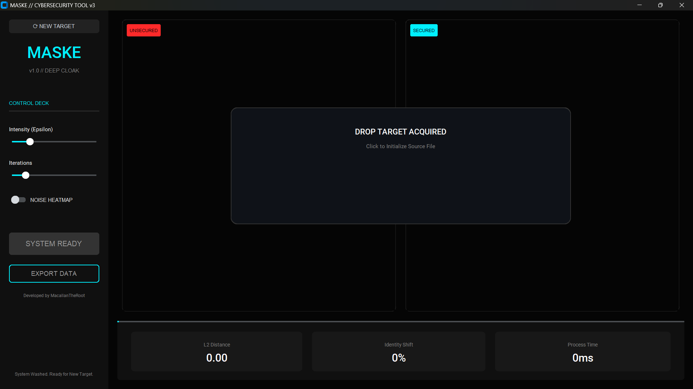
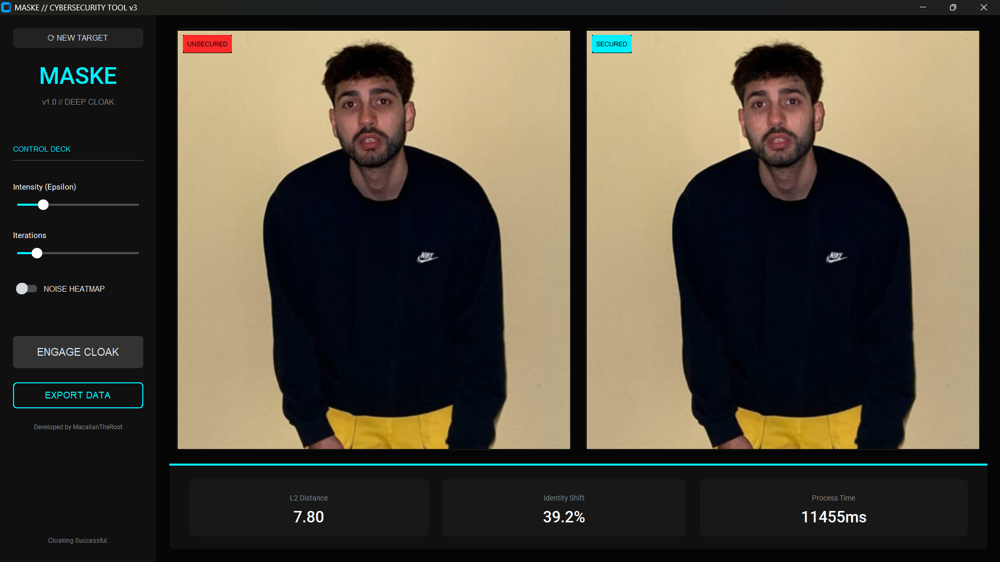

# 🛡️ PROJECT MASKE
### v3.0 // Deep Cloak Architecture

  <a href="#-english">🇬🇧 English</a> •
  <a href="#-türkçe">🇹🇷 Türkçe</a>

---

## 🇬🇧 English

**Project Maske** is an advanced privacy-preserving tool designed to protect your biometric data from unauthorized facial recognition systems (like Clearview AI). It uses **Adversarial Machine Learning** (specifically a Shifted Centroid PGD attack) to add invisible perturbations to your photos. To the human eye, the image looks unchanged. To an AI, the identity is completely erased or shifted.

> **🔒 Transparency Note:** This project is distributed as **Source Code Only**. We do not provide `.exe` files to ensure full transparency and security. You run exactly what you see.

### ✨ Key Features (v3.0)

* **🛡️ Deep Cloak Engine:** Uses high-intensity PGD optimization to shift feature vectors in the latent space.
* **📊 Live Intelligence:** Displays real-time **Identity Shift %** and **L2 Distance** scores, proving the cloaking effectiveness instantly.
* **👁️ Visual Verification:** Includes a **"Noise Heatmap"** mode. Toggle it to see the "invisible" protection layer in neon colors.
* **⚡ Zero-Loss Workflow:** Features a smart "Paste-Back" technology. Only the face is processed; the rest of your image retains its original 4K/HD resolution.
* **🎛️ Pro Controls:**
    * **Zoom & Pan:** Inspect pixel-level details with a synchronized dual-view canvas.
    * **Intensity Tuning:** Adjust `Epsilon` (Strength) and `Iterations` manually.
    * **Reset System:** Hot-swap targets without restarting the app.

### 🚀 Quick Start (No Coding Required)

**Prerequisite:** You must have **Python 3.10** or **Python 3.11** installed.
*(⚠️ Note: Python 3.14+ is NOT supported yet).*

1.  **Download:** Clone this repository or download the ZIP file and extract it.
2.  **Run:**
    * **Windows:** Double-click `run_windows.bat`.
    * **macOS / Linux:** Open terminal, run `chmod +x run_mac_linux.sh`, then run `./run_mac_linux.sh`.

*The script will automatically install all required AI libraries (`torch`, `customtkinter`, etc.) and launch the interface.*

### � Gallery

| Main Dashboard | Before / After |
|:---:|:---:|
|  |  |
| *Dark Mode Cyberpunk UI* | *Secured vs Unsecured* |

---

## 🇹🇷 Türkçe

**Project Maske**, biyometrik verilerinizi yetkisiz yüz tanıma sistemlerine (Clearview AI vb.) karşı korumak için tasarlanmış gelişmiş bir siber güvenlik aracıdır. Fotoğraflarınıza insan gözünün göremeyeceği, ancak Yapay Zeka modellerini kör eden **"Çekişmeli Gürültü" (Adversarial Noise)** ekler.

> **🔒 Güvenlik Notu:** Bu proje tam şeffaflık sağlamak amacıyla sadece **Kaynak Kod** olarak dağıtılmaktadır. İçerisinde ne olduğu belli olmayan `.exe` dosyaları yoktur. Kodları doğrudan çalıştırırsınız.

### ✨ Temel Özellikler (v3.0)

* **🛡️ Derin Gizleme Motoru:** Yüzünüzün dijital imzasını (vektörünü) değiştirmek için PGD optimizasyonu kullanır.
* **📊 Canlı Analiz:** İşlem sırasında **Kimlik Kayması (Identity Shift)** oranını ve **L2 Mesafesini** anlık olarak gösterir. Korumanın işe yaradığını sayılarla kanıtlar.
* **👁️ Görsel Doğrulama:** **"Gürültü Isı Haritası" (Heatmap)** modu sayesinde, koruma katmanının yüzünüzün neresine uygulandığını neon renklerle görebilirsiniz.
* **⚡ Kayıpsız İşlem:** Akıllı "Geri Yapıştırma" teknolojisi kullanır. Sadece yüzünüz işlenir, fotoğrafınızın geri kalanı orijinal kalitesini korur.
* **🎛️ Profesyonel Kontroller:**
    * **Zoom & Pan:** Pikselleri detaylı incelemek için senkronize yakınlaştırma.
    * **Hassas Ayar:** Koruma şiddetini (`Epsilon`) ve döngü sayısını (`Iterations`) elle ayarlayın.
    * **Sıfırlama:** Uygulamayı kapatmadan yeni fotoğraf yükleyin.

### 🚀 Hızlı Başlangıç (Kodlama Bilgisi Gerekmez)

**Gereksinim:** Bilgisayarınızda **Python 3.10** veya **Python 3.11** yüklü olmalıdır.

1.  **İndir:** Bu projeyi indirin ve klasörü zipten çıkarın.
2.  **Çalıştır:**
    * **Windows:** `run_windows.bat` dosyasına çift tıklayın.
    * **macOS / Linux:** Terminali açın, `chmod +x run_mac_linux.sh` yazın ve ardından `./run_mac_linux.sh` komutunu çalıştırın.

*Başlatıcı script, gerekli tüm Yapay Zeka kütüphanelerini (`torch`, `facenet`, `customtkinter`) sizin yerinize otomatik kuracak ve programı açacaktır.*

### 📸 Galeri

| Arayüz | Öncesi / Sonrası |
|:---:|:---:|
|  |  |
| *Modern Arayüz* | *Korumalı ve Korumasız* |

---

### 🛠️ Tech Stack / Teknolojiler

* **Core:** Python 3.11, PyTorch
* **AI Model:** InceptionResnetV1 (VGGFace2)
* **GUI:** CustomTkinter
* **Algorithm:** Projected Gradient Descent (PGD) / Shifted Centroid

---

*Developed by [MacallanTheRoot](https://github.com/MacallanTheRoot)*
*For Educational & Privacy Purposes Only.*

